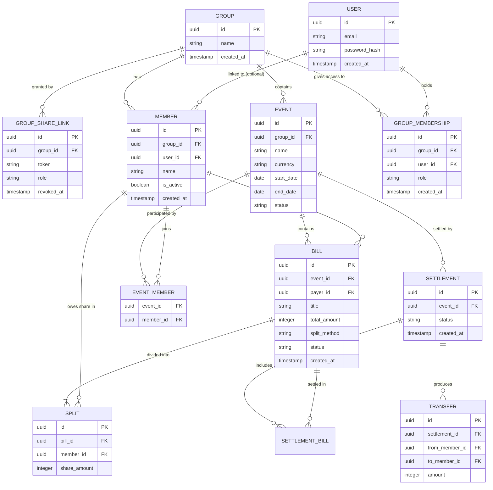

# Data Model — FairShareTab

**Version 2.1 · Adds optional user accounts (§9) on top of v2.0's group/sharing model.**

This document defines the database schema: entities, fields, relationships, and the
invariants that keep the money correct. It is the source of truth for the schema and
migrations. See `system-design.md` for architecture, API, and algorithms.

---

## 1. Overview

Ten tables. A **group** is the top-level container (a circle of friends/family). It
owns its **members** and its **events** (trips). Each event holds **bills**, and each
bill is divided into **splits** — one share per participating member. A group is
reachable either by an anonymous **share link** or, optionally, by a registered
**user** who holds a **group membership** — see §9.

```
group                       the friend circle; owns everything
 ├── group_share_link       capability tokens that grant access
 ├── group_membership       a registered user's standing access to this group
 ├── member                 people, reused across all events in the group
 └── event                  one per trip
      ├── event_member      which members joined this trip
      └── bill              an expense
           └── split        one member's share of that bill

user                         an optional authenticated identity
 └── group_membership       which groups this user can act in, and at what role

settlement                  a "settle up" run over selected bills
 ├── settlement_bill        which bills were included
 └── transfer               a single "X pays Y" instruction
```

Two things changed from v1 and both matter:

- **Members moved from `event` to `group`.** The same people travel together
  repeatedly, so they're added once per group and each event records which subset
  participated, without re-creating the person each trip.
- **`member.user_id` exists and is nullable.** A `member` is an *accounting entity*
  (a name that owes and is owed money). A `user` is an *authenticated identity*. They
  are deliberately separate — a member survives whether or not anyone ever links it to
  an account. See §9.

---

## 2. Entity Relationship Diagram



---

## 3. Data Dictionary

### 3.1 `group`

The top-level container. Never hard-deleted.

| Field | Type | Notes |
|---|---|---|
| `id` | UUID (PK) | Primary key. |
| `name` | string | e.g. "Family & Friends". Required, trimmed, non-empty. |
| `created_at` | timestamp | Set on creation. |
| `updated_at` | timestamp | Updated on any change. |

### 3.2 `group_share_link`

A capability token granting access to the whole group. A group may have several
(e.g. one editor link and one view-only link), and old ones are revoked rather than
deleted so history is auditable.

| Field | Type | Notes |
|---|---|---|
| `id` | UUID (PK) | Primary key. |
| `group_id` | UUID (FK) | References `group.id`. |
| `token` | string UNIQUE | ≥128 bits of CSPRNG entropy, base62 (~22 chars). Never sequential or guessable. Indexed for lookup. |
| `role` | enum | `editor` or `viewer`. |
| `revoked_at` | timestamp NULL | Non-null means the link no longer works. Regenerating sets this and issues a new row. |
| `created_at` | timestamp | Set on creation. |

### 3.3 `member`

A person in the group. **Members are never deleted** — only deactivated.

| Field | Type | Notes |
|---|---|---|
| `id` | UUID (PK) | Primary key. |
| `group_id` | UUID (FK) | References `group.id`. |
| `user_id` | UUID (FK) NULL | `NULL` until this member is linked to a registered account — see §9. Once set, application code never unsets it (no "unlink" flow in v1). |
| `name` | string | Display name. Required, editable. Shown everywhere, including for the viewer themselves (see §7). |
| `email` | string NULL | Optional, for future invites. Not used in v1. |
| `is_active` | boolean | Default `true`. When `false`, hidden from *new* bill pickers but retained on every bill they already appear on, and still settleable. |
| `avatar_color` | string | Assigned on creation for the initial-avatar treatment. |
| `created_at` | timestamp | Set on creation. Also the deterministic tiebreak order for rounding (§6.5). |

### 3.4 `event`

One trip within a group.

| Field | Type | Notes |
|---|---|---|
| `id` | UUID (PK) | Primary key. |
| `group_id` | UUID (FK) | References `group.id`. |
| `name` | string | e.g. "Japan Trip 2025". Required. |
| `currency` | string(3) | ISO 4217, from a curated list (MYR, SGD, JPY, CNY, TWD, USD, THB, IDR, HKD, EUR, GBP, AUD) — see `src/lib/currency.ts`. Defaults to `MYR`. Chosen at creation and **locked once the event has its first bill** (see §5, §6 invariant 9). |
| `start_date` | date NULL | Optional, for the date range in the header. |
| `end_date` | date NULL | Optional. |
| `status` | enum | `active` or `archived`. Never hard-deleted. |
| `created_at` | timestamp | Set on creation. |

### 3.5 `event_member`

Which members participated in which trip. Drives the default participant list when
adding a bill.

| Field | Type | Notes |
|---|---|---|
| `event_id` | UUID (FK) | Part of composite PK. |
| `member_id` | UUID (FK) | Part of composite PK. |

Primary key: `(event_id, member_id)`.

### 3.6 `bill`

A single expense within an event.

| Field | Type | Notes |
|---|---|---|
| `id` | UUID (PK) | Primary key. |
| `event_id` | UUID (FK) | References `event.id`. |
| `payer_id` | UUID (FK) | The member who paid. **Independent of participation** — the payer need not be in the split. |
| `title` | string | e.g. "Dinner at Ichiran". Required. |
| `total_amount` | integer | **In the event currency's smallest unit** (see §5). Must be > 0. |
| `split_method` | enum | `equal` or `custom`. |
| `status` | enum | `unsettled` or `settled`. Settled bills are locked from editing (§6, invariant 8). |
| `category` | string NULL | Optional (food, transport, lodging…). |
| `note` | text NULL | Optional free text. |
| `created_at` | timestamp | Set on creation. |
| `updated_at` | timestamp | Updated on any change. |

### 3.7 `split`

One member's share of one bill. Rows exist only for participating members.

| Field | Type | Notes |
|---|---|---|
| `id` | UUID (PK) | Primary key. |
| `bill_id` | UUID (FK) | References `bill.id`. Cascade-delete with the bill. |
| `member_id` | UUID (FK) | References `member.id`. |
| `share_amount` | integer | This member's owed portion, in the event currency's smallest unit. Must be ≥ 0. |

Unique constraint: `(bill_id, member_id)`.

### 3.8 `settlement`, `settlement_bill`, `transfer`

A settlement is one "settle up" run. It is **strictly event-scoped** — a settlement
always covers bills from exactly one event, which guarantees a single currency by
construction. Cross-event settlement is not supported.

`settlement`

| Field | Type | Notes |
|---|---|---|
| `id` | UUID (PK) | Primary key. |
| `event_id` | UUID (FK) | References `event.id`. |
| `status` | enum | `draft` or `confirmed`. |
| `created_at` | timestamp | Set on creation. |

`settlement_bill` — which bills were included. PK `(settlement_id, bill_id)`.

`transfer`

| Field | Type | Notes |
|---|---|---|
| `id` | UUID (PK) | Primary key. |
| `settlement_id` | UUID (FK) | References `settlement.id`. |
| `from_member_id` | UUID (FK) | The debtor (pays). |
| `to_member_id` | UUID (FK) | The creditor (receives). |
| `amount` | integer | In the event currency's smallest unit. Must be > 0. |

### 3.9 `user`

An optional authenticated identity. Registration is entirely optional — the anonymous
share-link model (§4) keeps working unchanged whether or not a `user` row ever exists
for a given person. See §9.

| Field | Type | Notes |
|---|---|---|
| `id` | UUID (PK) | Primary key. |
| `email` | string UNIQUE | Normalized to lowercase before insert (Postgres unique indexes are case-sensitive by default). |
| `password_hash` | string | Argon2id hash. Never included in any API response or client-visible payload. |
| `created_at` | timestamp | Set on creation. |
| `updated_at` | timestamp | Updated on any change. |

### 3.10 `group_membership`

A registered user's standing access to one group — the authenticated-session
counterpart to `group_share_link`. Unlike a share link, this is tied to a specific
`user`, not a bearer token.

| Field | Type | Notes |
|---|---|---|
| `id` | UUID (PK) | Primary key. |
| `group_id` | UUID (FK) | References `group.id`. |
| `user_id` | UUID (FK) | References `user.id`. |
| `role` | enum | `editor` or `viewer` (reuses the `group_share_link` role enum). v1 only ever creates `editor` memberships — a group's registered creator. The field exists for a possible future co-owner-invite feature. |
| `created_at` | timestamp | Set on creation. |

Unique constraint: `(group_id, user_id)` — a user has at most one membership per group.

---

## 4. What is *not* in the database

**Per-viewer identity.** Access is granted purely by which share link (token)
was opened — there is no concept of "which member is browsing" stored
anywhere, client- or server-side. Anyone with an editor link can act as any
member; anyone with a viewer link sees everything read-only. This is a
deliberate simplification: no localStorage, no "who am I" step, and no
per-viewer "you" marker (see §7 below, which no longer describes a "you" marker).

This holds for the anonymous share-link flow regardless of whether a `user` exists —
a registered member entering their own group over a `group_membership` (§9) is known
to the server (`member.user_id`), but that still never surfaces as a "you" marker in
the UI (§7's display rule applies identically either way).

---

## 5. Money handling — multi-currency

Each **event** picks its own currency (default MYR) from a curated list defined in
`src/lib/currency.ts`: MYR, SGD, JPY, CNY, TWD, USD, THB, IDR, HKD, EUR, GBP, AUD.

- Every amount is stored as an integer number of the currency's smallest unit — its
  ISO 4217 minor unit. For 2-decimal currencies (everything in the list except JPY),
  1 unit = 100 smallest units, so `RM 12.50` is stored as `1250`. **JPY has zero
  decimal places** — `¥1,500` is stored as `1500`, not `150000`.
- Never use `float`, `double`, or `Decimal`-as-string for amounts. Integer columns only.
- Convert to display only at the UI boundary: `amount / 10 ** minorUnit`, formatted
  with the currency's symbol and the correct number of decimal places
  (`RM 1,240.00`, `¥1,500`) — see `formatMoney` in `src/lib/format.ts`.
- Parse user input at the UI boundary too, respecting the event's minor unit: for
  2-decimal currencies, accept `1240`, `1240.00`, `1,240.00` → `124000`; for JPY, accept
  whole numbers only (`1500` → `1500`), reject a decimal point.
- Equal-split rounding (§6 invariant 5) is minor-unit-agnostic — it only ever
  distributes a remainder of whole smallest units, so it needs no special case for
  zero-decimal currencies.

---

## 6. Invariants (must always hold)

1. **Splits sum to total** — for every bill,
   `SUM(split.share_amount) = bill.total_amount`. Enforced in the application layer on
   every create and update, inside a transaction.
2. **Payer belongs to the group** — `bill.payer_id` is a member of the event's group.
3. **Participants belong to the group** — every `split.member_id` is a member of the
   event's group.
4. **Net balances sum to zero** — across any set of bills, the sum of all members' net
   positions is exactly 0. This is a computed property, never stored.
5. **Equal-split rounding** — when the total doesn't divide evenly, the remainder
   (in the event currency's smallest unit) is assigned deterministically: to the
   **payer** if the payer is a participant, otherwise to participants in
   `member.created_at` order, one unit each. The sum must still equal the total
   exactly. Example: `RM 250.00 / 3` → `8334 / 8333 / 8333` sen.
6. **Members are never deleted** — only `is_active = false`.
7. **Groups and events are never hard-deleted** — events use `status = 'archived'`.
8. **Settled bills are immutable** — a bill with `status = 'settled'` cannot be edited
   or deleted until it is unsettled.
9. **One currency per event, locked at creation** — an event's `currency` is chosen
   when it's created and cannot change once the event has its first bill. Settlement
   is always scoped to a single event (§3.8), so netting never crosses currencies.
10. **Share tokens are unique and unguessable** — ≥128 bits of CSPRNG entropy.
11. **Email is unique, case-insensitively** — normalized to lowercase at write time
    before the uniqueness check/insert.
12. **`password_hash` is never returned to the client** — excluded from every API
    response and log line, no exceptions.
13. **`member.user_id`, once set, is never unset by application code** — claiming a
    member into an account is one-directional in v1; there is no "unlink account" flow.

---

## 7. Display rule: member names

Member names render plainly and identically for anyone with the link — there
is no per-viewer identity to mark, so there is no "you" variant anywhere.

- Correct: `Sarah`, `Sarah owes RM 158.30`, `Paid by Sarah`.
- Not applicable: any per-viewer "you" rendering — no such state exists.

The reason is concrete: people screenshot these screens into group chats. "Sarah owes
RM 158.30" is meaningful to all six people who see it; "You owe RM 158.30" is
meaningful to one.

This has **no schema impact** — `member.name` already holds the name. It is purely a
presentation rule, but it is binding across every screen.

Consequence: **the group creator must supply their own name** when creating a group,
so the owner is never an unnamed member. See `system-design.md` §5.

---

## 8. Relationships and delete behaviour

- `group` → many `member`, `event`, `group_share_link`.
- `event` → many `bill`, `settlement`; many `member` via `event_member`.
- `bill` → one `payer` (member), many `split`. **Deleting a bill cascades to its
  splits.**
- `settlement` → many `transfer`; many `bill` via `settlement_bill`.
- Nothing else is ever hard-deleted: members deactivate, events archive, share links
  revoke.

---

## 9. Authentication (optional, coexists with anonymous links)

Registration is optional. Anonymous share-link access (§4) is unaffected whether or
not a person ever creates an account — both are permanent, first-class ways in.

- `user` (§3.9) holds an email + password hash. Registering does not, by itself,
  grant access to any group.
- `group_membership` (§3.10) is what actually grants a registered user standing
  access to a group, parallel to `group_share_link` for anonymous access.
- A group's creator is granted a `group_membership` at creation time if they were
  logged in when they created it. An anonymous ("visitor") creator can **register
  later** while still holding the session for the group they created: registration
  links that group's creator `member.user_id` to the new account and creates the
  matching `group_membership` in the same transaction ("claim on register"). The
  claim only ever targets the specific member the visitor created — a share-link
  session carries no identity of *which* member the holder is, so there is nothing
  to claim off a link to someone else's group.
- The access check on every group route is "valid share-link session **or** valid
  authenticated-member session" — never one replacing the other.
- A registered user may hold `group_membership` rows for any number of groups
  (multi-group creation is exactly what an account unlocks — an anonymous visitor is
  capped at one group, enforced by a best-effort device cookie, not by this schema).

`member` and `user` are never merged into one table. A member is a name on a bill and
must survive whether or not a person ever creates an account.

---

## 10. Suggested indexes

- `group_share_link(token)` — unique, hot path on every request.
- `member(group_id)`, `member(group_id, is_active)`
- `event(group_id)`, `event(group_id, status)`
- `event_member(member_id)`
- `bill(event_id)`, `bill(event_id, status)`
- `split(bill_id)`, `split(member_id)`
- `settlement_bill(bill_id)`, `transfer(settlement_id)`

---

## 11. Out of scope for v1

- **Email verification** — a new account is usable immediately. Accepted as low-stakes
  today (worst case: claiming your own just-created group under an unverified email)
  but must be revisited before any future email-based invite feature.
- **Password reset** — no self-service recovery path yet; a deliberate, known gap, not
  a silent oversight.
- **OAuth / social login** — email + password only.
- **Changing an event's currency after its first bill, and cross-currency
  settlement** — an event's currency is fixed once money has been recorded against
  it (§6 invariant 9), and settlement never spans more than one event/currency.
- **Multiple payers per bill** — would need a `bill_payer` join table with amounts.
- **Receipt image attachments.**
- **Audit log of edits** — worth adding early if disputes become a problem.
