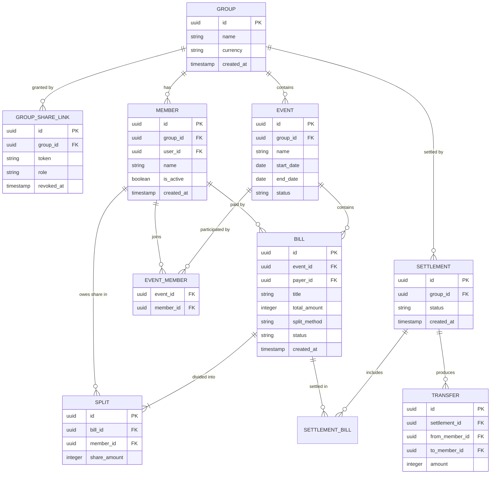

# Data Model — FairShareTab

**Version 2.0 · Supersedes v1 (event-scoped model with no groups or sharing).**

This document defines the database schema: entities, fields, relationships, and the
invariants that keep the money correct. It is the source of truth for the schema and
migrations. See `system-design.md` for architecture, API, and algorithms.

---

## 1. Overview

Eight tables. A **group** is the top-level container (a circle of friends/family). It
owns its **members** and its **events** (trips). Each event holds **bills**, and each
bill is divided into **splits** — one share per participating member.

```
group                       the friend circle; owns everything
 ├── group_share_link       capability tokens that grant access
 ├── member                 people, reused across all events in the group
 └── event                  one per trip
      ├── event_member      which members joined this trip
      └── bill              an expense
           └── split        one member's share of that bill

settlement                  a "settle up" run over selected bills
 ├── settlement_bill        which bills were included
 └── transfer               a single "X pays Y" instruction
```

Two things changed from v1 and both matter:

- **Members moved from `event` to `group`.** The same people travel together
  repeatedly, so they're added once per group and each event records which subset
  participated. This also lets balances net across trips.
- **`member.user_id` exists and is nullable.** A `member` is an *accounting entity*
  (a name that owes and is owed money). A `user` is an *authenticated identity*. They
  are deliberately separate so login can be added later without a data migration.
  See §9.

---

## 2. Entity Relationship Diagram



---

## 3. Data Dictionary

### 3.1 `group`

The top-level container. Never hard-deleted.

| Field | Type | Notes |
|---|---|---|
| `id` | UUID (PK) | Primary key. |
| `name` | string | e.g. "Family & Friends". Required, trimmed, non-empty. |
| `currency` | string(3) | ISO 4217. **v1 launches with `MYR` only** (see §5). Lives on the group, not the event, because balances net across events and you cannot net across currencies. |
| `created_at` | timestamp | Set on creation. |
| `updated_at` | timestamp | Updated on any change. |

### 3.2 `group_share_link`

A capability token granting access to the whole group. A group may have several
(e.g. one editor link and one view-only link), and old ones are revoked rather than
deleted so history is auditable.

| Field | Type | Notes |
|---|---|---|
| `id` | UUID (PK) | Primary key. |
| `group_id` | UUID (FK) | References `group.id`. |
| `token` | string UNIQUE | ≥128 bits of CSPRNG entropy, base62 (~22 chars). Never sequential or guessable. Indexed for lookup. |
| `role` | enum | `editor` or `viewer`. |
| `revoked_at` | timestamp NULL | Non-null means the link no longer works. Regenerating sets this and issues a new row. |
| `created_at` | timestamp | Set on creation. |

### 3.3 `member`

A person in the group. **Members are never deleted** — only deactivated.

| Field | Type | Notes |
|---|---|---|
| `id` | UUID (PK) | Primary key. |
| `group_id` | UUID (FK) | References `group.id`. |
| `user_id` | UUID (FK) NULL | Always `NULL` in v1. Reserved for linking to an authenticated user later — see §9. |
| `name` | string | Display name. Required, editable. Shown everywhere, including for the viewer themselves (see §7). |
| `email` | string NULL | Optional, for future invites. Not used in v1. |
| `is_active` | boolean | Default `true`. When `false`, hidden from *new* bill pickers but retained on every bill they already appear on, and still settleable. |
| `avatar_color` | string | Assigned on creation for the initial-avatar treatment. |
| `created_at` | timestamp | Set on creation. Also the deterministic tiebreak order for rounding (§6.5). |

### 3.4 `event`

One trip within a group.

| Field | Type | Notes |
|---|---|---|
| `id` | UUID (PK) | Primary key. |
| `group_id` | UUID (FK) | References `group.id`. |
| `name` | string | e.g. "Japan Trip 2025". Required. |
| `start_date` | date NULL | Optional, for the date range in the header. |
| `end_date` | date NULL | Optional. |
| `status` | enum | `active` or `archived`. Never hard-deleted. |
| `created_at` | timestamp | Set on creation. |

An event has no `currency` — it inherits the group's.

### 3.5 `event_member`

Which members participated in which trip. Drives the default participant list when
adding a bill.

| Field | Type | Notes |
|---|---|---|
| `event_id` | UUID (FK) | Part of composite PK. |
| `member_id` | UUID (FK) | Part of composite PK. |

Primary key: `(event_id, member_id)`.

### 3.6 `bill`

A single expense within an event.

| Field | Type | Notes |
|---|---|---|
| `id` | UUID (PK) | Primary key. |
| `event_id` | UUID (FK) | References `event.id`. |
| `payer_id` | UUID (FK) | The member who paid. **Independent of participation** — the payer need not be in the split. |
| `title` | string | e.g. "Dinner at Ichiran". Required. |
| `total_amount` | integer | **In sen** (see §5). Must be > 0. |
| `split_method` | enum | `equal` or `custom`. |
| `status` | enum | `unsettled` or `settled`. Settled bills are locked from editing (§6, invariant 8). |
| `category` | string NULL | Optional (food, transport, lodging…). |
| `note` | text NULL | Optional free text. |
| `created_at` | timestamp | Set on creation. |
| `updated_at` | timestamp | Updated on any change. |

### 3.7 `split`

One member's share of one bill. Rows exist only for participating members.

| Field | Type | Notes |
|---|---|---|
| `id` | UUID (PK) | Primary key. |
| `bill_id` | UUID (FK) | References `bill.id`. Cascade-delete with the bill. |
| `member_id` | UUID (FK) | References `member.id`. |
| `share_amount` | integer | This member's owed portion, in sen. Must be ≥ 0. |

Unique constraint: `(bill_id, member_id)`.

### 3.8 `settlement`, `settlement_bill`, `transfer`

A settlement is one "settle up" run. It is **group-scoped**, not event-scoped, so
bills from multiple events in the same group can be settled together. The v1 UI
settles within a single event, but the schema supports cross-event settlement with no
migration.

`settlement`

| Field | Type | Notes |
|---|---|---|
| `id` | UUID (PK) | Primary key. |
| `group_id` | UUID (FK) | References `group.id`. |
| `status` | enum | `draft` or `confirmed`. |
| `created_at` | timestamp | Set on creation. |

`settlement_bill` — which bills were included. PK `(settlement_id, bill_id)`.

`transfer`

| Field | Type | Notes |
|---|---|---|
| `id` | UUID (PK) | Primary key. |
| `settlement_id` | UUID (FK) | References `settlement.id`. |
| `from_member_id` | UUID (FK) | The debtor (pays). |
| `to_member_id` | UUID (FK) | The creditor (receives). |
| `amount` | integer | In sen. Must be > 0. |

---

## 4. What is *not* in the database

**Device identity.** When someone opens a share link they pick which member they are.
That choice is stored **client-side only** (cookie or `localStorage`), as a map of
`group_id → member_id` so one device can hold identities in several groups.

It is an unverified self-declaration — treat it as **personalisation, never
authorisation**. Access is granted by the share token; the claimed member only decides
whose name gets the "you" marker.

---

## 5. Money handling — MYR

v1 launches with **Malaysian Ringgit (MYR)** only.

- 1 MYR = 100 sen. **Store every amount as an integer number of sen.**
  `RM 12.50` is stored as `1250`.
- Never use `float`, `double`, or `Decimal`-as-string for amounts. Integer columns only.
- Convert to display only at the UI boundary: `sen / 100`, formatted with the `RM`
  prefix and exactly 2 decimal places (`RM 1,240.00`).
- Parse user input at the UI boundary too: accept `1240`, `1240.00`, `1,240.00` →
  `124000` sen. Reject more than 2 decimal places.
- The schema already supports other currencies via `group.currency`. Anything with a
  different minor unit (JPY has none) must be handled before enabling it — see §11.

---

## 6. Invariants (must always hold)

1. **Splits sum to total** — for every bill,
   `SUM(split.share_amount) = bill.total_amount`. Enforced in the application layer on
   every create and update, inside a transaction.
2. **Payer belongs to the group** — `bill.payer_id` is a member of the event's group.
3. **Participants belong to the group** — every `split.member_id` is a member of the
   event's group.
4. **Net balances sum to zero** — across any set of bills, the sum of all members' net
   positions is exactly 0. This is a computed property, never stored.
5. **Equal-split rounding** — when the total doesn't divide evenly, the remainder sen
   are assigned deterministically: to the **payer** if the payer is a participant,
   otherwise to participants in `member.created_at` order, one sen each. The sum must
   still equal the total exactly. Example: `RM 250.00 / 3` → `8334 / 8333 / 8333` sen.
6. **Members are never deleted** — only `is_active = false`.
7. **Groups and events are never hard-deleted** — events use `status = 'archived'`.
8. **Settled bills are immutable** — a bill with `status = 'settled'` cannot be edited
   or deleted until it is unsettled.
9. **One currency per group** — all bills in a group share `group.currency`. Netting
   across currencies is not permitted.
10. **Share tokens are unique and unguessable** — ≥128 bits of CSPRNG entropy.

---

## 7. Display rule: the viewer's own name

The viewer's member record renders as **their actual name plus a quiet "you" marker** —
never as the bare word "You".

- Correct: `Sarah (you)`, or `Sarah` with a "you" chip / highlighted avatar ring.
- Wrong: `You`, `You owe RM 158.30`, `Paid by You`.

The reason is concrete: people screenshot these screens into group chats. "Sarah owes
RM 158.30" is meaningful to all six people who see it; "You owe RM 158.30" is
meaningful to one.

This has **no schema impact** — `member.name` already holds the name. It is purely a
presentation rule, but it is binding across every screen.

Consequence: **the group creator must supply their own name** when creating a group,
so the owner is never an unnamed member. See `system-design.md` §5.

---

## 8. Relationships and delete behaviour

- `group` → many `member`, `event`, `group_share_link`, `settlement`.
- `event` → many `bill`; many `member` via `event_member`.
- `bill` → one `payer` (member), many `split`. **Deleting a bill cascades to its
  splits.**
- `settlement` → many `transfer`; many `bill` via `settlement_bill`.
- Nothing else is ever hard-deleted: members deactivate, events archive, share links
  revoke.

---

## 9. Designed-in path to authentication (phase 2)

`member.user_id` is nullable from day one specifically so login can be added without a
migration. When the time comes:

1. Add a `user` table (id, email, password hash / OAuth identity) and auth endpoints.
2. Add `group_membership (group_id, user_id, role)`.
3. On signup, set `member.user_id` on the member that device had already claimed. All
   historical bills, splits and balances carry over untouched.
4. Change the access check from "valid share token" to "valid session **or** valid
   share token". Both can coexist permanently — guest links remain a feature.

Do not merge `member` and `user` into one table. A member is a name on a bill and must
survive whether or not a person ever creates an account.

---

## 10. Suggested indexes

- `group_share_link(token)` — unique, hot path on every request.
- `member(group_id)`, `member(group_id, is_active)`
- `event(group_id)`, `event(group_id, status)`
- `event_member(member_id)`
- `bill(event_id)`, `bill(event_id, status)`
- `split(bill_id)`, `split(member_id)`
- `settlement_bill(bill_id)`, `transfer(settlement_id)`

---

## 11. Out of scope for v1

- **User accounts / login** — designed for (§9) but not built.
- **Multi-currency** — schema supports it; MYR only at launch. Enabling another
  currency requires handling zero-decimal currencies (JPY) in parsing, display, and
  the rounding rule, plus a decision on whether groups may ever change currency after
  bills exist (recommended: no).
- **Multiple payers per bill** — would need a `bill_payer` join table with amounts.
- **Receipt image attachments.**
- **Audit log of edits** — worth adding early if disputes become a problem.
